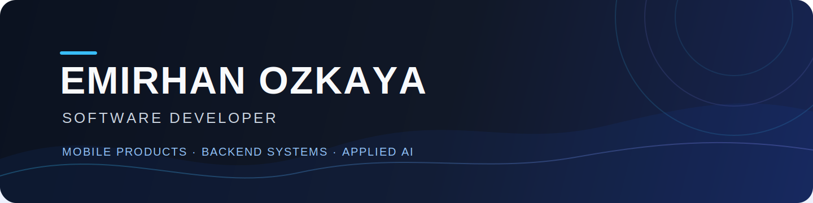

<p align="center">
  
</p>

<p align="center">
  <a href="https://flutter.dev"></a>
  <a href="https://dart.dev"></a>
  <a href="https://supabase.com"></a>
  <a href="https://firebase.google.com"></a>
  <a href="https://dotnet.microsoft.com"></a>
  <a href="https://www.python.org"></a>
</p>

## About

I build product-focused mobile and backend applications with clear architecture,
secure data boundaries and practical user experience decisions.

My recent work covers Flutter applications, Supabase and Firebase backends,
ASP.NET Core systems and computer-vision experiments.

## Featured Work

| Project | Product Focus | Engineering Highlights |
| --- | --- | --- |
| [**ARCA TRIBUN**](https://github.com/CREDO019/ARCA_TRIBUN) | Digital fan experience and matchday assistant concept | Flutter, Riverpod, Supabase, RLS, offline fallbacks |
| [**Engelsiz Kaldirim**](https://github.com/CREDO019/engelsiz_kaldirim) | Civic reporting for sidewalk accessibility | Flutter, Firebase, ML Kit OCR, location workflows |
| [**Ahlatci Web App**](https://github.com/CREDO019/ahlatciwebapp) | Subscriber and invoice management | ASP.NET Core MVC, EF Core, SQL Server, role-based authorization |
| [**RaiseTrack AI**](https://github.com/CREDO019/raisetrack-ai) | AI-assisted product experiment | Python, rapid prototyping, applied AI workflow |

## Engineering Focus

```text
Mobile Products      Flutter · Dart · Riverpod
Backend Systems      Supabase · PostgreSQL · Firebase · ASP.NET Core
Data & Security      Row Level Security · Auth · Local persistence
Applied AI           OCR · Computer vision · Product experiments
```

## Current Direction

- Building portfolio-grade products with realistic architecture and documentation
- Improving mobile release quality through testing, offline behavior and secure configuration
- Turning prototypes into clear, demo-ready product stories

## Contact

For project discussions and collaboration, open an issue in the relevant
repository or reach out through GitHub.
